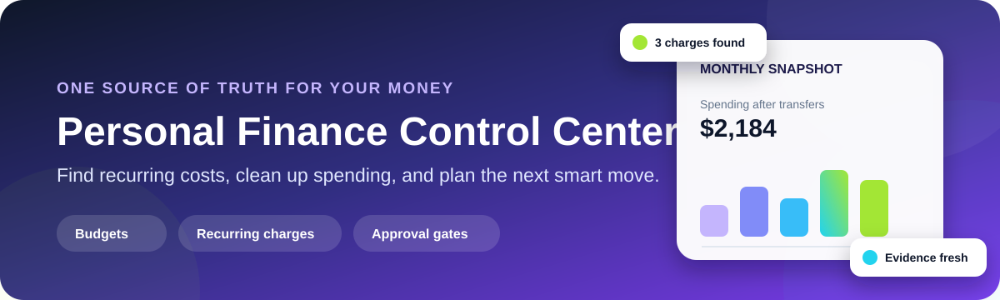
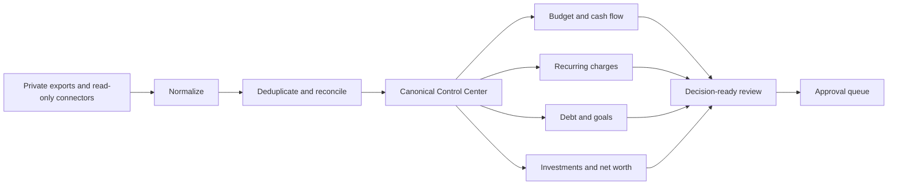

<div align="center">
  
  <h1>Personal Finance Control Center</h1>
  <p><strong>Turn scattered accounts and exports into one decision-ready financial picture.</strong></p>
  <p>
    
    
    <a href="https://github.com/lukegeel101/personal-finance-agent-skill/actions/workflows/ci.yml"></a>
  </p>
</div>

Most finance tools give you more charts.
This privacy-first Agentic Skill is designed to give you cleaner facts, visible uncertainty, and a short list of decisions that actually matter.

It can pull together private, normalized bank, credit, investment, statement, and file data without hard-coding a specific institution.
Then it cleans the evidence before calculating budgets, recurring charges, debt plans, savings goals, or net worth.

## Useful things it catches

| Messy real-world situation | What the Control Center does |
| --- | --- |
| The same transaction appears in a statement and a connector feed. | Deduplicates the overlap while retaining provenance. |
| A credit-card payment looks like new spending. | Keeps it for reconciliation but excludes it from purchase-spending totals. |
| A connector says it synced three years but returned eighteen months. | Records the requested window and the history actually returned. |
| A monthly charge quietly appears three times. | Flags it as a recurring candidate with amount and cadence evidence. |
| A reimbursement is expected next week. | Keeps it separate from available cash until receipt is verified. |
| Two agents find conflicting balances. | Preserves both claims and moves the conflict to verification instead of silently choosing one. |
| A cancellation flow was submitted but no confirmation appeared. | Keeps the action pending until direct merchant evidence exists. |

> [!IMPORTANT]
> A fresh connection is not proof of fresh data.
> Every material snapshot keeps its source, observation time, coverage, and uncertainty.

## One Control Center, several focused agents



Every agent reads the same current state, registers a bounded workstream, writes back material findings, and closes only its own workstream.
That makes parallel finance work useful instead of chaotic.

## A fictional audit might return

```text
Source coverage
  Requested window                           Jun 1 to Aug 31
  Actual records returned                    Jun 1 to Aug 15
  Freshness                                  Static export, not real time

Clean purchase spending
  Housing                                    $4,200.00
  Groceries                                  $265.75
  Subscriptions                              $44.97

Recurring candidates
  Example Rental Housing                     3 monthly occurrences
  Streamflix Example                         3 monthly occurrences

Excluded from purchase spending
  Internal transfers, card payments, refunds, and cashback

External actions taken
  None. Recommendations remain approval-gated.
```

Those values come from the fictional sample data included in this repository.

## What makes the evidence trustworthy

Every important fact uses one of six explicit states:

| Status | Meaning |
| --- | --- |
| `CONFIRMED` | Direct evidence or an uncontradicted explicit user statement supports it. |
| `CONNECTED_SNAPSHOT` | A connector observed it at a stated time, but it may change. |
| `USER_REPORTED` | The user supplied it and it has not been independently verified. |
| `ESTIMATE` | It was calculated or approximated with stated assumptions. |
| `PLAN` | It is a target or strategy, not a completed transaction. |
| `PENDING_VERIFICATION` | Evidence is incomplete, stale, conflicting, or missing. |

The Control Center never silently promotes an estimate into a confirmed fact.

## Quick start

1. Keep the fictional examples unchanged and create private copies for real data.
2. Map an export into the generic transaction columns in [references/data-contract.md](references/data-contract.md).
3. Validate the workspace and run the mock audit.

```bash
python3 scripts/validate_workspace.py
python3 scripts/demo_audit.py
python3 -m unittest discover -s tests -v
```

4. Invoke `$personal-finance-agent-skill` in a ChatGPT-style skill environment.
5. In a Claude-style project, keep `CLAUDE.md` at the root and ask Claude to follow `SKILL.md`.

## Try asking it

### Find recurring charges

```text
Audit my private normalized transactions for recurring and recurring-like charges.
Show the cadence, amount stability, source coverage, and uncertainty.
Prepare cancellation candidates, but do not cancel anything.
```

### Clean up a spending report

```text
Deduplicate the statement and connector records.
Exclude transfers, card payments, refunds, and cashback from purchase spending.
Compare the clean category totals with my saved budget.
```

### Build a debt plan

```text
Compare payoff options using my verified balance, rate, minimum payment, cash floor, and monthly surplus.
Keep projected income separate from current cash.
Do not submit a payment or application.
```

### Review investments

```text
Separate taxable and retirement accounts.
Review allocation, concentration, fees, expense ratios, and cash drag from verified holdings.
Do not trade or change contributions.
```

More prompts are available in [examples/prompts.md](examples/prompts.md).

## Approval gates are a feature

The skill can research and recommend external actions.
It cannot treat them as authorized or completed by default.

Separate action-time confirmation is required before:

- Connecting an account or granting a data scope.
- Submitting a payment or moving money.
- Canceling a subscription.
- Applying for credit.
- Buying or selling an asset.
- Changing a contribution or account setting.

After an action, direct provider or merchant evidence is still required before the Control Center marks it complete.

## Connector-neutral by design

`src/finance_control/adapters.py` defines a provider-neutral `FinancialConnector` protocol.
Provider-specific authentication and API behavior belong in private adapters or separate integration packages.

The included CSV adapter is read-only and operates only on fictional mock data.

## Privacy model

- Never commit real balances, transactions, holdings, statements, tax records, or account identifiers.
- Keep credentials, tokens, security answers, and one-time codes outside agent context.
- Prefer read-only connector scopes.
- Import only the fields and date range needed for the analysis.
- Keep raw source files private and minimize retention.

Read [SECURITY.md](SECURITY.md) and [references/privacy-security.md](references/privacy-security.md) before handling real financial data.

## Under the hood

The canonical workflow is:

1. Read the current Control Center and newest changes.
2. Register a bounded, non-overlapping workstream.
3. Import private data through a read-only adapter.
4. Normalize, deduplicate, and label the evidence.
5. Run the requested analysis.
6. Separate findings, estimates, plans, and action proposals.
7. Update current state and the dated change log.
8. Verify the write-back and close the workstream.

See [references/control-center-workflow.md](references/control-center-workflow.md) for the full operating model.

## Related Agentic Skill

Want the same evidence-first, approval-gated approach for household shopping?
See the [Grocery Shopping Agent](https://github.com/lukegeel101/grocery-shopping-agent-skill), which compares complete delivered baskets, current deals, coupons, and allowed substitutions without placing an order.

## Repository map

```text
.
|-- SKILL.md                         Agent instructions
|-- CLAUDE.md                        Claude-style entrypoint
|-- agents/openai.yaml               ChatGPT/Codex metadata
|-- assets/readme-hero.svg           README artwork
|-- config/finance.example.json      Connector-neutral example
|-- data/sample/                     Fictional finance data
|-- scripts/demo_audit.py            Mock audit demonstration
|-- scripts/validate_workspace.py    Privacy and contract validator
|-- src/finance_control/             Adapter and audit primitives
|-- references/                      Evidence, workflow, and privacy rules
`-- tests/                            Regression tests
```

## Important limitation

This project organizes evidence and decisions.
It is not financial, tax, legal, or investment advice, and it cannot guarantee that imported data is complete or current.

## License

MIT.
