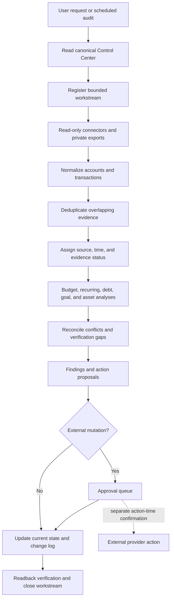

# Architecture

The system separates raw source evidence, normalized facts, analysis, plans, and confirmed actions.
That separation lets several agent sessions work from the same Control Center without turning an inference into a fact.



## Layers

| Layer | Responsibility | Examples |
| --- | --- | --- |
| Source | Preserve provenance and coverage | Connector batch, statement, export, merchant record |
| Normalization | Produce comparable records | Dates, signed amounts, currency, descriptor, account reference |
| Reconciliation | Resolve overlap without erasing evidence | Deduplication and replacement-card continuity |
| Control Center | Hold current facts, labels, conflicts, workstreams, and changes | JSON, database, or document |
| Analysis | Calculate requested views | Budget, subscriptions, fees, debt, goals, net worth |
| Approval | Separate recommendations from mutations | Payment, cancellation, transfer, account link |

## Connector boundary

```text
provider-specific private adapter
             |
             v
FinancialConnector protocol
             |
             v
normalized Account, Transaction, Balance, and Holding records
```

The public core never handles login UI, multi-factor authentication, or token storage.
A provider adapter may expose only the fields and operations granted by its read-only scope.

## Evidence lifecycle

```text
raw observation
      |
      v
CONNECTED_SNAPSHOT or USER_REPORTED
      |
      v
reconciled with direct evidence
      |
      +--> CONFIRMED
      |
      +--> PENDING_VERIFICATION
```

Plans and estimates stay distinct from the evidence lifecycle.
An approved external action remains pending until direct completion evidence exists.

